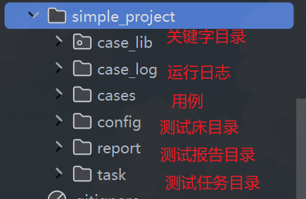
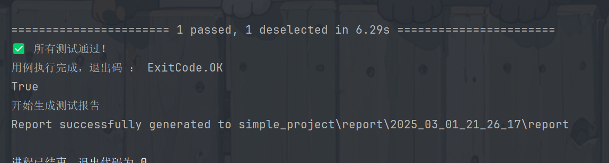

# flutter_test
README 图片解析异常可以查看 ： https://gitee.com/lxl-plus/flutter_test
## 框架简介
框架目标用户是测开和TSE

对于测开：
- 框架要足够简单，任何测开半小时内上手；
- 可切换测试床和选择不同的测试任务集，方便应对不同的需求；
- 可视化，降低调试成本；
- 可拓展，适应项目需要；
- 耦合性低，框架目录结构分明，对项目代码的改动不会影响框架功能；
- 提供多样的工具，避免过多重复造轮子；
- 用例管理；
- 自动化资产管理，例如关键字；
- 简化分析，使用ai提升分析效率【实验中】；

对于TSE：
- 可以选择用例构建，应对项目需要；
- 使用简单，不涉及自动化知识；
- 界面友好，可查看构建进度；

## 当前开发进度
- [x] 用例基本运行 
- [x] 测试任务编排
- [x] 测试床编排
- [x] 基本可视化【简单的运行后通过查看】
- [x] 测试报告，目前由allure生成，依赖allure
- [ ] ai分析测试用例【实验中】
- [ ] 用例管理系统【包括测试用例、关键字、测试任务、测试床、构建下发、构建进度查看】

## 快速开始
项目开发使用python版本是3.10

安装python后，执行

```bash
pip install -r requirements.txt
```
执行case_server下面的case_server.py运行服务器，打开网页 http://127.0.0.1:8080/index.html
```bash
python ./case_server/case_server.py
```
然后运行根目录下的main.py
```bash
python main.py
```
运行后即可查看到demo的运行结果

点击用例名称可以缩起列表

点击请求路径可以查看请求的详情，包括请求头、参数、响应

## 常用功能
### 目录结构说明
总目录结构

框架目录

项目目录

### 用例编写
一个用例的基本结构如下，需要注意的是 case_tags 里要包含用例 case_id 里的用例id

框架通过FrameBean获取日志服务（自定义的服务也可以通过该类获取）

步骤与断言使用框架提供的组件
```python
from frame.core.frame_bean import FrameBean
from frame.core.frame_visualization import frame
from frame.utils.common_utils import frame_case, AssertUtil
logger = FrameBean.get_service('logger')
class TestFrame:
    @frame_case(
        case_id=["TC001"],
        case_name="用例 1",
        case_tags=["TC001", "标签1", "标签2"],
        case_author="long"
    )
    def test_logger_1(self):
        with frame.step('1步骤 1'):
            logger.info('日志1')
            AssertUtil.assert_equal(expr=(1 == 1 ), success_msg='验证成功', fail_msg='验证失败')
        with frame.step('1步骤 2'):
            logger.info('日志2')
```
### 测试床添加
可以在项目目录下面建测试床，json文件可以随需要填写

测试床添加后可以配置当前项目使用该测试床

可以在测试用例或者项目中使用下面的代码随时获取测试床配置的值，例如，获取刚刚配置的remote_ip的值
```python
from frame.core.frame_config import ConfigManager
remote_ip = ConfigManager.get('remote_ip')
```
### 测试任务管理
在项目目录下的task目录新建任务文件，这里的id对应case_tags里填写的用例id

配置当前项目运行该任务

配置完成后执行main.py即可运行指定任务
### 动态自定义配置
在main.py同级下创建self_conf.json即可动态修改配置

frame_conf 里面填框架配置的键值对

user_conf 里面填测试床的键值对

填写后会这里的配置会在运行时覆盖原有的框架以及测试床配置
```json
{
  "user_conf": {},
  "frame_conf": {}
}
```
### allure报告生成（暂用allure生成报告）
生成报告需要你的机器安装allure,
运行框架时会打印报告的位置

运行后可以到该位置查看报告，默认只生成allure文件，需要自己执行命令生成报告（考虑默认是调试的情况）

执行以下命令生成报告
```bash
allure generate simple_project\report\2025_03_01_21_10_50 -o simple_project\report\2025_03_01_21_10_50\report --clean
```
可以看到标签作者和执行信息

可以修改这个值在运行完成后自动生成报告

配置后再运行即可自动生成报告
